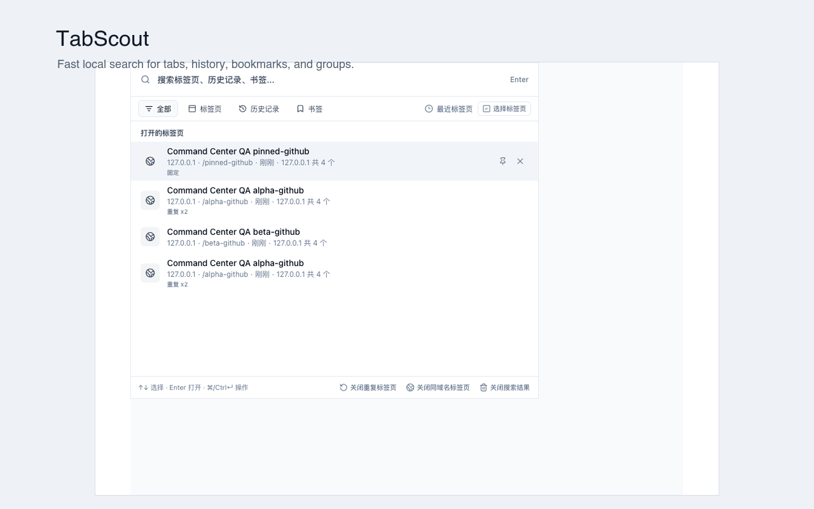
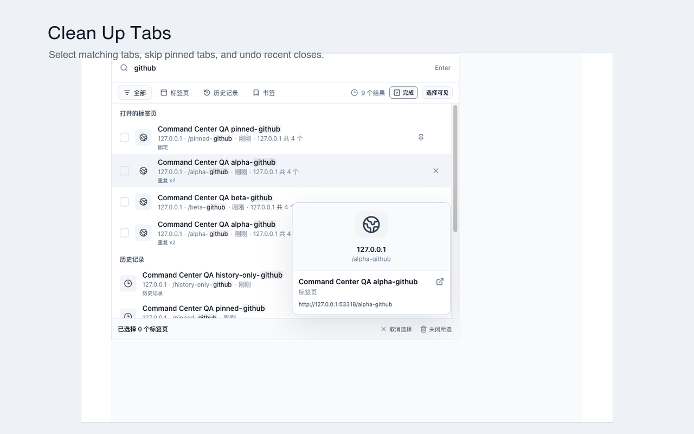
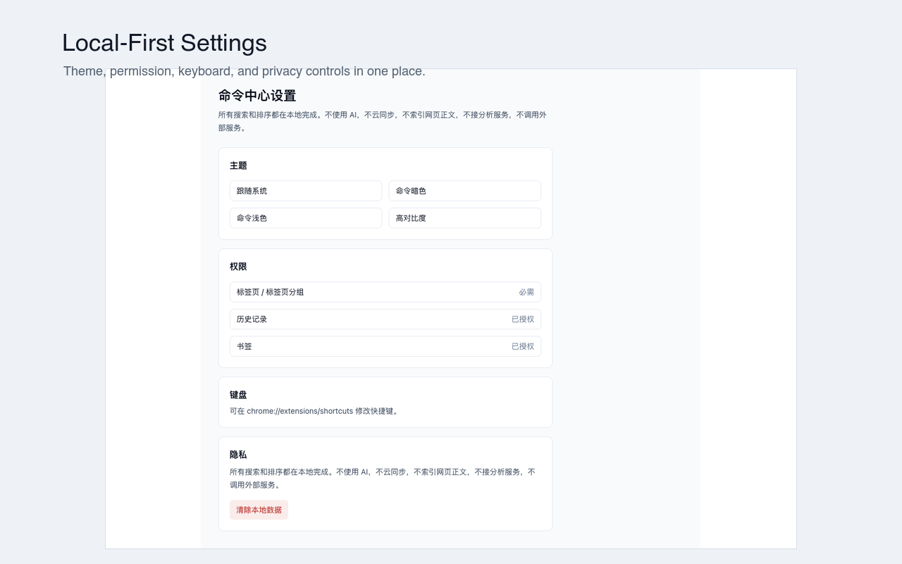

# TabScout

<p align="center">
  <a href="README.md"><strong>English</strong></a>
  ·
  <a href="README.zh-CN.md">简体中文</a>
</p>

<p align="center">
  
  
  
  
  
</p>

<p align="center">
  <a href="docs/privacy-policy.md"><strong>Privacy Policy</strong></a>
  ·
  <a href="docs/store-listing.md"><strong>Store Listing Copy</strong></a>
</p>



Local-first Chrome command palette for quickly searching, switching, and cleaning up tabs, history, bookmarks, and tab groups.

TabScout is built for users who keep many tabs open and want a keyboard-first way to find pages, switch across windows, search history and bookmarks, and safely clean up duplicate or same-domain tabs.

## Screenshots






## Features

- Search open tabs across all Chrome windows.
- Match title, domain, path, and full URL.
- Activate a selected tab and focus its window.
- Search Chrome history after optional permission is granted.
- Search Chrome bookmarks after optional permission is granted.
- Switch scopes between All, Tabs, History, Bookmarks, and Groups.
- Use prefix commands:
  - `t github` or `tab github`: tabs only
  - `h github` or `his github`: history only
  - `b github` or `bm github`: bookmarks only
- Use search filters:
  - `site:github.com`
  - `title:react`
  - `url:pull`
  - `window:current`
  - `pinned:true`
- Manage tabs:
  - switch to tab
  - close selected tab
  - close duplicate URL tabs
  - close same-domain tabs
  - close matching search-result tabs
  - select multiple visible tab results and close them safely
  - undo recent close actions when tab snapshots can be restored
- Keyboard flow:
  - input autofocus
  - Up/Down to select
  - Enter to open/switch
  - Esc to close popup
  - Cmd/Ctrl + Enter to open actions
  - Cmd/Ctrl + Backspace to close the selected tab
- Theme support:
  - system
  - command dark
  - command light
  - high contrast
- i18n:
  - English
  - Simplified Chinese

## Privacy And Permissions

TabScout is local-first:

- No AI.
- No cloud sync.
- No analytics SDK.
- No external service calls.
- No page-body indexing.
- No content scripts.
- No host permissions.
- History and bookmarks are requested only when the user opens or searches those scopes.

Requested Chrome permissions:

- `tabs`: read and manage open tabs, activate tabs, close tabs, and restore tabs for undo.
- `storage`: store theme, recent tab activity, and undo metadata locally.
- `tabGroups`: read tab group metadata for display.
- Optional `history`: search Chrome history locally.
- Optional `bookmarks`: search Chrome bookmarks locally.

See the published [privacy policy](docs/privacy-policy.md).

## Development

Requirements:

- Node.js compatible with the current WXT/Vite toolchain.
- npm.

Install dependencies:

```bash
npm install
```

Start the WXT development server:

```bash
npm run dev
```

Run checks:

```bash
npm run typecheck
npm run lint
npm run test
npm run build
```

Run Playwright e2e tests:

```bash
npm run e2e
```

## Release Package

Create the Chrome MV3 upload zip:

```bash
npm run zip
```

The zip is written to:

```text
.output/tabscout-0.1.0-chrome.zip
```

Before uploading to the Chrome Web Store, verify the zip contains `manifest.json` at the root:

```bash
unzip -l .output/tabscout-0.1.0-chrome.zip | head
```

## Local Installation

1. Run `npm run build`.
2. Open `chrome://extensions`.
3. Enable Developer mode.
4. Click "Load unpacked".
5. Select `.output/chrome-mv3`.
6. Pin the extension from Chrome's toolbar if desired.
7. Open `chrome://extensions/shortcuts` to adjust the command shortcut.

Default command shortcut:

- macOS: `Command+Shift+Space`
- Other platforms: `Ctrl+Shift+Space`

## Chrome Web Store Status

TabScout is prepared for Chrome Web Store beta submission. Store copy, screenshots, permission explanations, and QA notes are in [docs/chrome-web-store-prep.md](docs/chrome-web-store-prep.md).

## Repository Notes

Generated build artifacts, local QA work files, Playwright reports, and Chrome Web Store zip packages are ignored by git. Store screenshots and promotional images under `docs/assets/store/` are intentionally tracked for public listing preparation.

## Disclaimer

TabScout is not affiliated with or endorsed by Google, Chrome, Alfred, Raycast, Arc, GitHub, Figma, Notion, Linear, or any other third-party product shown in screenshots or examples.

